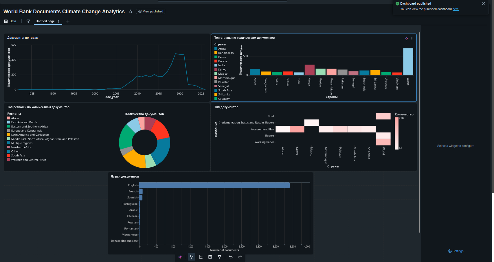

# World Bank Documents Pipeline

Небольшой проект на Databricks: тяну метаданные документов из публичного API
Всемирного банка, чищу и привожу в порядок, а сверху строю аналитику с дашбордом.
Данные настоящие, не выдуманные. Сделано на PySpark и Spark SQL в бесплатной версии
Databricks.

Дашборд можно посмотреть [тут](https://dbc-a70e7d4e-5c85.cloud.databricks.com/dashboardsv3/01f16bc9ebe8117e8e0ca09167480586/published?o=7474652523837884),
но ссылка, скорее всего, попросит вход в Databricks, так что ниже скриншот.

## Как устроено

Стандартная медальон-схема: bronze, silver, gold.

Сначала отдельный шаг ходит в API постранично и складывает сырой JSON в хранилище.
Извлечение я держу отдельно от обработки специально, чтобы при ошибке в трансформации
не дёргать API заново. В bronze сырьё лежит как есть, по одной записи на документ.

Самое интересное в silver. JSON из этого API довольно неаккуратный: схема скачет
(поле страны бывает то строкой, то списком), часть полей у некоторых записей просто
нет. Поэтому я не доверяю автоопределению схемы, а задаю её явно и достаю ровно то,
что нужно. Там же парсю даты, убираю дубликаты по id и отправляю битые записи в
карантин, а не выбрасываю молча.

Отдельно про дубли: их оказалось 181 из 4000. Это не брак, а повторы из-за пагинации,
когда один документ попадает на разные страницы. Дедупликация по id через оконную
функцию их убрала, осталось 3819.

В gold шесть витрин под аналитику: по годам, странам, регионам, типам документов,
языкам и матрица «страна на тип». На дашборде пять разных видов графиков, один из них
я собрал на Vega-Lite, потому что встроенных типов не хватило.

## Стек

PySpark, Spark SQL, Delta, Unity Catalog, Volumes, дашборды Databricks, Vega-Lite,
requests для похода в API.

## Пара оговорок

Выборку я ограничил 4000 документами по запросу «climate change», так что за самые
свежие годы цифры неполные. Это сделано осознанно, всё подряд из API тянуть смысла
нет.
